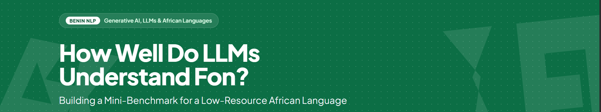

# fon-worshop-indabaXBenin

A hands-on mini-benchmark for evaluating LLMs on Fon (Fongbe), covering translation, grammar, cultural understanding, tokenization, and error analysis.

Website of the workshop details : 

Slides : https://docs.google.com/presentation/d/1CZDWfQIueuUopPu3bkKPojmNFB-y3lo59xWnSet9PXQ/edit?usp=sharing 
